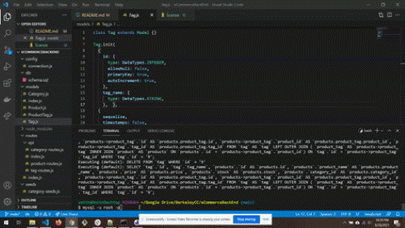

# E-commerce Back End 

## Decription
E-commerce is a driving force in the world wide web. Being able to develop elements is crucial to becoming a member of the development community.

This backend development allows users to add, remove, and update products, categories of products, and product tags for a retail company.

### Intallation
Clone the GitHub repo and run NPM install for the technologies used: node, express, mysql2, sequelize, and dotenv.

## Usage
Video: GET api routes https://drive.google.com/file/d/1NdDcLWHhYemU6rnCuXweQUyeglm21Rig/view
Video: GET api individual https://drive.google.com/file/d/1ZiRUCVf3y04du2NPMScqAm8isM1hbfNC/view
Video: POST, PUT, DELETE for categories, products, and tags https://drive.google.com/file/d/1-sUVUl0XgU3DY46MQT06zJojOEP0fpU9/view?usp=sharing
Video: verifying technical requirements, schema, and seeding https://drive.google.com/file/d/16O7AV2zUk9mbeJOMgt7woxIyuZZc1Pc4/view

### Credits
Work completed by Brad Smith &copy 2021

### License
MIT license - see the licence file in repo for details
